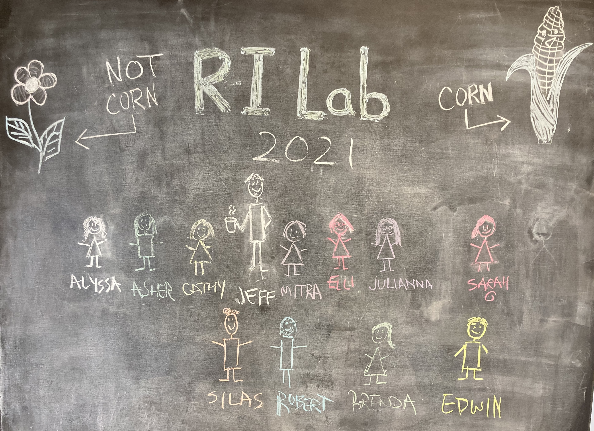
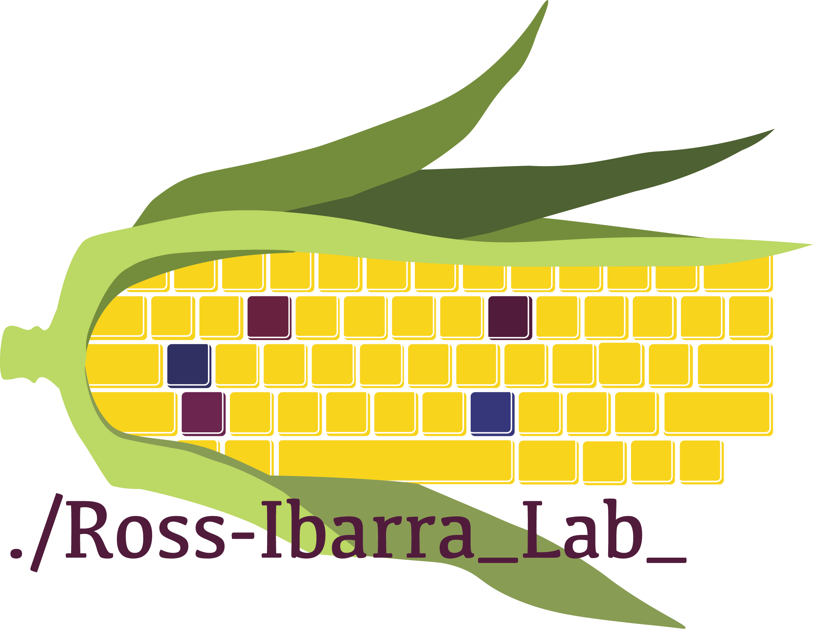

Welcome to the Ross-Ibarra Lab in the [Dept. of Evolution and Ecology](http://eve.ucdavis.edu) as well as the [Center for Population Biology](http://eve.ucdavis.edu) and the [Genome Center](http://eve.ucdavis.edu) at the [University of California Davis](http://www.ucdavis.edu). We work on the evolutionary genetics of maize and teosinte. Please explore to see [who we are](people.html) and [what we do](research.html), check out the [news](news.html) for updates and latest happenings, read our [lab philosophy and expectations](expectations.html), or even join our [journal club](rehab.html).  

</a>

  
 

### Contact Info  
Jeffrey Ross-Ibarra  
530-752-4565
Dept. of Evolution and Ecology  
University of California  
Storer Hall, One Shields Ave  
Davis, CA 95616
  

<!--  -->
<!--  -->
<!--  -->

