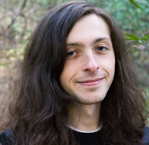
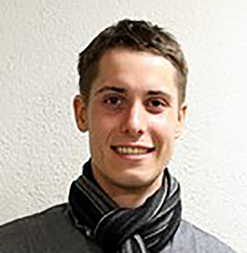

## Current R-I Lab members
Please read more information on [joining the lab](prosp.html)

<!-- break -->
 
<!-- break -->

**Dan Gates** 

Dan is a postdoctoral scholar who studies adaptive introgression and local adaptation in maize landraces as part of the [HiLo](http://highlandadaptation.org) project.

<!-- break -->
 
<!-- break -->

**Asher Hudson** 

Asher is a graduate student in [Population Biology](http://www-eve.ucdavis.edu/eve/pbg/) working on genotype by envrionment interaction in maize as part of the [maize diversity project](http://www.panzea.org).

<!-- break -->
 
<!-- break -->

**Nathaniel Langlois-Ackerson**

Nate is a plant sciences major working on thermogenesis and germination in highland maize.

<!-- break -->
 
<!-- break -->

**Wenbin Mei** 

Wenbin is a postdoctoral scholar who works on copy number variation and inversions in maize and teosinte as part of the [maize diversity project](http://www.panzea.org).

<!-- break -->
 
<!-- break -->

**Sarah Odell** 

Sarah is a plant biology graduate student coadvised by [Dan Runcie](http://runcielab.ucdavis.edu), working on evolutionary and statistical genetics in maize.
<!-- <!-- break --> 
<!--    -->
<!-- <!-- break --> 

<!-- 
 -->
<!--  -->
<!-- 
 -->

<!-- **Ellen Osborn** -->

<!-- Ellen is an undergraduate majoring in Global Disease Biology. She is working with Michelle Stitzer on the population genetics of transposable elements. -->

<!-- break -->
 
<!-- break -->

**Jeffrey Ross-Ibarra**  

Jeff is a Professor in the [Department of Plant Sciences](http://www.plantsciences.ucdavis.edu/plantsciences/) and a faculty member of the [Center for Population Biology](http://cpb.ucdavis.edu) and the [Genome Center](ttp://www.genomecenter.ucdavis.edu). 

<!-- break -->
  
<!-- break -->

**Catherine Rushworth** 
<a href="https://cathyrushworth.weebly.com">

Cathy is a postdoctoral scholar working on the genomics and quantitative genetics of recombination rate variation in maize and teosinte as part of the [maize diversity project](http://www.panzea.org).

<!-- break -->
 
<!-- break -->

**Markus Stetter** 

Markus is [DFG postdoctoral fellow](http://www.dfg.de/en/research_funding/programmes/individual/research_fellowships/) working on domestication and adaptation in polygenic traits in maize and teosinte.

<!-- break -->
 
<!-- break -->

**Michelle Stitzer** 

Michelle is a graduate student in [Population Biology](http://www-eve.ucdavis.edu/eve/pbg/), working on the population genetics of transposable elements in maize and Arabidopsis as part of the [maize diversity project](http://www.panzea.org/#!michelle-stitzer/c121o).

<!-- break -->
 
<!-- break -->

**Dianne Velasco** 

Dianne is a graduate student in [Integrated Genetics and Genomics](http://biosci3.ucdavis.edu/GradGroups/GGG/Default.aspx). She studies domestication and evolution of peaches, almonds, and their relatives in the genus *Prunus*.

<!-- break -->
 
<!-- break -->

**Li Wang** 

Li is a research scientist working half time on studying inbreeding depression and load in maize and teosinte synthetic populations. She's also crazy about ferns.

<!-- <!-- break --> 
<!--   -->
<!-- <!-- break --> 

<!-- 
 -->
<!--  -->
<!-- 
 -->
<!-- **Leo Zeitler** <a href="https://twitter.com/leo_zeitler"> -->

<!-- Leo is an MS student visiting the lab to work on landrace diversity and double haploids. -->

<!-- break -->
 
<!-- break -->

## Lab Alumni

* [Anne Lorant](https://scholar.google.com/citations?user=mnHb3lYAAAAJ&hl=en): Lab manager, PhD student, postdoc 2013-2018 (Postdoc, UC Davis)
* [Emily Josephs](https://josephslab.github.io): Postdoc 2015-2018 (Asst. Professor, MSU)
* [Luis Avila](https://lmavila.github.io): Programmer 2016-2018 (IT Breeding Tool Project Leader, HM Clause)
* [Anna O'Brien](https://annamobrien.wordpress.com): PhD Student 2011-2017 (Postdoc, U. Toronto)
* [Jinliang Yang](http://jyanglab.com): Postdoc 2014-2017 (Assistant Professor, U. Nebraska)
* [Josh Hough](https://scholar.google.fr/citations?user=FmClXYIAAAAJ&hl=en): Postdoc 2016-2017 (Postdoc, UC Santa Cruz)
* [Paul Bilinski](https://scholar.google.com/citations?user=c03DwHkAAAAJ&hl=en): PhD Student 2010-2016 (Associate Professor, West Shore Community College)
* [Simon Renny-Byfield](https://scholar.google.com/citations?hl=en&user=uZTFIaAAAAAJ): Postdoc 2014-2016 (Research Scientist, Dupont Pioneer)
* [Kate Crosby](https://github.com/kate-crosby): Postdoc 2014-2015 (Research Scientist, Monsanto)
* Sayuri Tsukahara: Postdoc 2013-2015
* [Tim Beissinger](http://timbeissinger.github.io): Postdoc 2014-2015 (Research Geneticist, USDA-ARS U. Missouri)
* [Arun Durvasula](https://arundurvasula.wordpress.com): Undergraduate 2013-2015 (PhD Student, UCLA)
* Nivaz Brar: Undergraduate 2014-2015
* [Chris Fiscus](https://cjfiscus.github.io/): Undergraduate 2014 (PhD Student, UC Riverside)
* [Tyler Kent](https://github.com/tvkent): Undergraduate 2013-2015 (PhD Student, U. Toronto)
* [Vince Buffalo](http://www.vincebuffalo.com): Computational Biologist 2013-2014  (PhD Student, UC Davis)
* [Sofiane Mezmouk](http://www.linkedin.com/pub/sofiane-mezmouk/6b/a35/a34): Postdoc 2012-2014 (Research Scientist, KWS)
* [Shohei Takuno](https://sites.google.com/site/shoheitakuno/): Postdoc 2012-2013 (Asst. Professor, SOKENDAI)
* [Matthew Hufford](http://www.public.iastate.edu/~mhufford/HuffordLab/home.html): Postdoc 2010-2013 (Asst. Professor, Iowa State)
* [Tanja Pyhäjärvi](https://wiki.oulu.fi/pages/viewpage.action?pageId=13382392): Postdoc 2010-2012 (Sr. Research Fellow, U. Oulu)
* [Joost van Heerwaarden](http://www.wageningenur.nl/en/Persons/dr.ir.-J-Joost-van-Heerwaarden.htm): Postdoc 2009-2011 (Researcher, U. Wageningen)

### Visiting Scholar: for >100 hours of scholastic visitation

* [Kelly Dawe](http://www.dawelab.org)  
* [Rute Fonseca](http://rutefonseca.wix.com/bioinformatics)
* [Eric Fuchs](https://sites.google.com/site/ejfuchs/) 
* [Peter Morrell](http://faculty.agronomy.cfans.umn.edu/pmorrell/)
* [Chad Niederhuth](http://niederhuthlab.com)
* [Ginnie Morrison](http://www.panzea.org/#!ginnie-morrison/c1lov)
* [Markus Stetter](http://mstetter.github.io)

### Fellow of the R-I Lab: for >500 hours of scholastic fellowship

* [Peter Tiffin](http://www.cbs.umn.edu/lab/tiffin)

### Current Collaborators

**Dynamics of quantitative trait evolution and linked selection**
* [Ryan Hernandez](http://hernandezlab.ucsf.edu)
* [Kevin Thornton](http://www.molpopgen.org)

**Biology of rare alleles in maize and teosinte**

* [Ed Buckler](http://www.maizegenetics.net)
* [Peter Bradbury](http://www.panzea.org/peter-bradbury)
* [John Doebley](http://teosinte.wisc.edu)
* [Sherry Flint-Garcia](http://web.missouri.edu/~flint-garcias/)
* [Jim Holland](http://www4.ncsu.edu/~jholland/homepage.htm)
* [Matthew Hufford](http://www.public.iastate.edu/~mhufford/HuffordLab/home.html)
* [Qi Sun](http://vivo.cornell.edu/display/individual24418)
* [Doreen Ware](http://warelab.org)

**Evolutionary genetics of highland adaptation in maize**

* [Graham Coop](https://gcbias.org)
* [Sherry Flint-Garcia](http://web.missouri.edu/~flint-garcias/)
* [Matthew Hufford](http://www.public.iastate.edu/~mhufford/HuffordLab/home.html)
* [Ruben Rellan-Alvarez](http://www.rrlab.org)
* [Dan Runcie](http://runcielab.ucdavis.edu/)
* [Ruairidh Sawers](http://www.langebio.cinvestav.mx/?pag=165)

