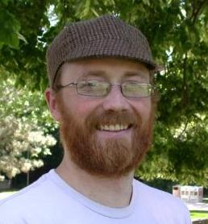
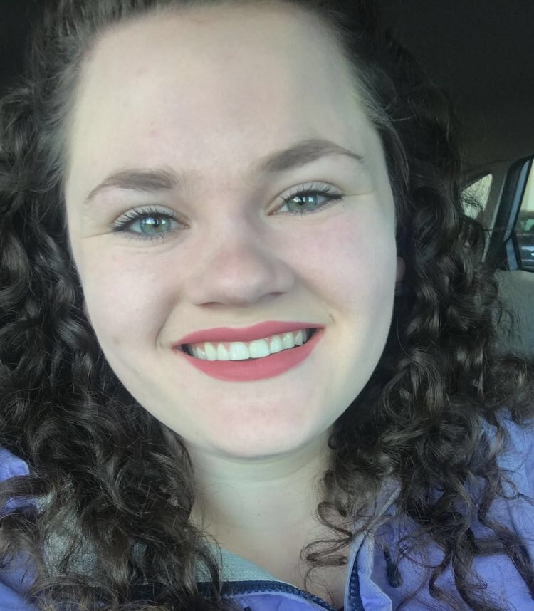
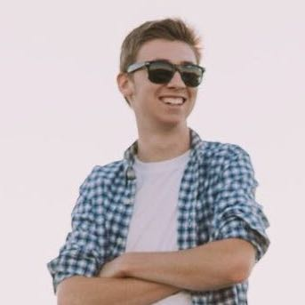
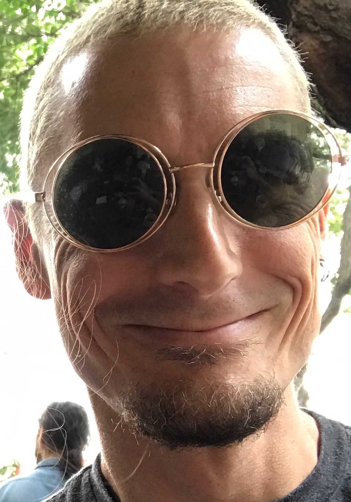
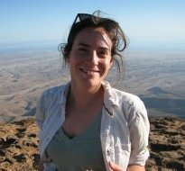
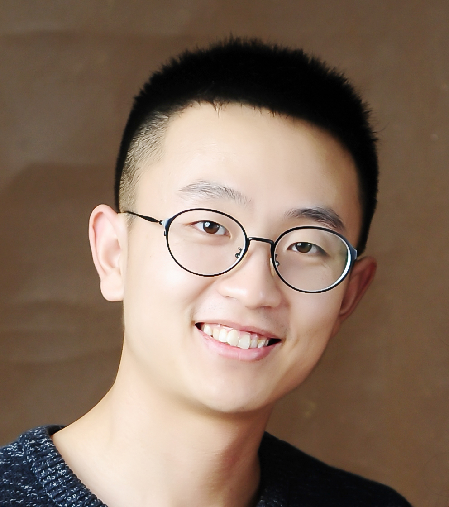

## Current R-I Lab members
Please read more information on [joining the lab](prosp.html)
<!-- break -->

  <!-- break -->

<!-- break -->
 
<!-- break -->

  
</a>

 

**Elli Cryan** 

Elli is a plant biology graduate student coadvised by [Dan Kliebenstein](https://psfaculty.plantsciences.ucdavis.edu/kliebenstein/), working on the evolution of gene networks.  
<!-- break -->
 
<!-- break -->

  
</a>

  
**Dan Gates** 

<a href="https://twitter.com/dangates_j"></a

Dan is a postdoctoral scholar who studies adaptive introgression and local adaptation in maize landraces as part of the [HiLo](http://highlandadaptation.org) project.  
<!-- break -->
 
<!-- break -->

</a>

**Sarah Hissong** 

Sarah is a [NSF postdoctoral fellow](https://www.nsf.gov/awardsearch/showAward?AWD_ID=1711347&HistoricalAwards=false) and the Linnean Fellow of Oleraceous Genetics.  She works on the population and quantitative genetics of Brassica.  
<!-- break -->
 
<!-- break -->

</a>

**Asher Hudson** 

Asher is a graduate student in [Population Biology](http://www-eve.ucdavis.edu/eve/pbg/) working on genotype by envrionment interaction in maize as part of the [maize diversity project](http://www.panzea.org).  
<!-- break -->
 
<!-- break -->

</a>

**Ashley Johnson** 

Ashley is a Biochemistry major, currently working on using machine learning methods to identify deleterious alleles in maize.  
<!-- break -->
 
<!-- break -->

</a>

**Andi Kur** 

Andi is a visiting graduate student from the University of Vermont, working on climate adaptation of maize landraces.
<!-- break -->
   
<!-- break -->

</a>

**Nathaniel Langlois-Ackerson**

Nate is a plant sciences major working on thermogenesis and germination in highland maize.

<!-- break -->
 
<!-- break -->

  
</a>

 

**Sean McGinty** 

Sean is an undergraduate working on background selection in maize. 
<!-- break -->
     
<!-- break -->

</a>

**Sarah Odell** 

Sarah is a plant biology graduate student coadvised by [Dan Runcie](http://runcielab.ucdavis.edu), working on evolutionary and statistical genetics in maize.  
<!-- break -->
 
<!-- break -->

</a>

**Taylor Perkins** 

Taylor is our Lab Czar, managing the wetlab side of our research. He was previously at U. Tennessee where he earned a MS in Environmental Science working on chestnuts.  
<!-- break -->
 
<!-- break -->

</a>

**Alyssa Phillips** 

Alyssa is a Plant Biology graduate student working on environmental adaptation in big blue stem as part of the [PanAnd project](https://panandropogoneae.com).  
<!-- break -->
 
<!-- break -->

</a>

**Jeffrey Ross-Ibarra** 
 

<a href="https://github.com/rossibarra/CV">

Jeff is a Professor in the [Department of Evolution and Ecology](http://eve.ucdavis.edu) and a faculty member of the [Center for Population Biology](http://cpb.ucdavis.edu) and the [Genome Center](ttp://www.genomecenter.ucdavis.edu).   
<!-- break -->
  
<!-- break -->

</a>

**Catherine Rushworth** 
<a href="https://cathyrushworth.weebly.com">

Cathy is a postdoctoral scholar working on the genomics and quantitative genetics of recombination rate variation in maize and teosinte as part of the [maize diversity project](http://www.panzea.org).  
<!-- break -->
 
<!-- break -->

</a>

**Silas Tittes**

  

Silas is a postdoc and the lab's current Felix Andrews Statistical Fellow, working on approaches to study convergent evolution as part of the [PanAnd project](https://panandropogoneae.com).

<!-- break -->
 
<!-- break -->

</a>

**Ning Yang** 

Ning is a postdoctoral fellow working on admixture between maize and teosinte.  
<!-- break -->
 
<!-- break -->

## Lab Alumni

* [Michelle Stitzter](http://mcstitzer.github.io) PhD student 2013-2019 (NSF Postdoc, Cornell)
* [Dianne Velasco](https://scholar.google.com/citations?user=h2_YtiYAAAAJ&hl=en) PhD Student 2010-2019 (USDA-ARS National Clonal Germplasm Repository)
* [Li Wang](https://scholar.google.com/citations?user=yGEvdz0AAAAJ&hl=en): Postdoc 2018-2019 (Research Scientist, Agricultural Genomics Institute Shenzhen)
* [Markus Stetter](https://www.cropevolution.org): Postdoc 2017-2019 (Asst. Group Leader, U. Köln)
* [Wenbin Mei](https://scholar.google.com/citations?user=LR1KOxwAAAAJ&hl=en): Postdoc 2016-2018 (Scientist at Inari Agriculture)
* [Anne Lorant](https://scholar.google.com/citations?user=mnHb3lYAAAAJ&hl=en): Lab manager, PhD student, postdoc 2013-2018 (Postdoc, UC Davis)
* [Emily Josephs](https://josephslab.github.io): Postdoc 2015-2018 (Asst. Professor, MSU)
* [Luis Avila](https://lmavila.github.io): Programmer 2016-2018 (Research Scientist, Genentech)
* [Anna O'Brien](https://annamobrien.wordpress.com): PhD Student 2011-2017 (Postdoc, U. Toronto)
* [Jinliang Yang](http://jyanglab.com): Postdoc 2014-2017 (Assistant Professor, U. Nebraska)
* [Josh Hough](https://scholar.google.fr/citations?user=FmClXYIAAAAJ&hl=en): Postdoc 2016-2017 
* [Paul Bilinski](https://scholar.google.com/citations?user=c03DwHkAAAAJ&hl=en): PhD Student 2010-2016 (Associate Professor, West Shore Community College)
* [Simon Renny-Byfield](https://scholar.google.com/citations?hl=en&user=uZTFIaAAAAAJ): Postdoc 2014-2016 (Research Scientist, Dupont Pioneer)
* [Kate Crosby](https://github.com/kate-crosby): Postdoc 2014-2015 (Research Scientist, Indigo Ag)
* Sayuri Tsukahara: Postdoc 2013-2015
* [Tim Beissinger](https://www.uni-goettingen.de/en/599788.html): Postdoc 2014-2015 (Professor, U. Göttingen)
* [Arun Durvasula](https://arundurvasula.wordpress.com): Undergraduate 2013-2015 (PhD Student, UCLA)
* Nivaz Brar: Undergraduate 2014-2015
* [Chris Fiscus](https://cjfiscus.github.io/): Undergraduate 2014 (PhD Student, UC Riverside)
* [Tyler Kent](https://github.com/tvkent): Undergraduate 2013-2015 (PhD Student, U. Toronto)
* [Vince Buffalo](http://www.vincebuffalo.com): Programmer 2013-2014  (PhD Student, UC Davis)
* [Sofiane Mezmouk](http://www.linkedin.com/pub/sofiane-mezmouk/6b/a35/a34): Postdoc 2012-2014 (Research Scientist, KWS)
* [Shohei Takuno](https://sites.google.com/site/shoheitakuno/): Postdoc 2012-2013 (Asst. Professor, SOKENDAI)
* [Matthew Hufford](http://www.public.iastate.edu/~mhufford/HuffordLab/home.html): Postdoc 2010-2013 (Assoc. Professor, Iowa State)
* [Tanja Pyhäjärvi](https://wiki.oulu.fi/pages/viewpage.action?pageId=13382392): Postdoc 2010-2012 (Sr. Research Fellow, U. Oulu)
* [Joost van Heerwaarden](http://www.wageningenur.nl/en/Persons/dr.ir.-J-Joost-van-Heerwaarden.htm): Postdoc 2009-2011 (Researcher, U. Wageningen)

### Visiting Scholar: for >100 hours of scholastic visitation

* [Kelly Dawe](http://www.dawelab.org)  
* [Rute Fonseca](http://rutefonseca.wix.com/bioinformatics)
* [Eric Fuchs](https://sites.google.com/site/ejfuchs/) 
* [Peter Morrell](http://faculty.agronomy.cfans.umn.edu/pmorrell/)
* [Chad Niederhuth](http://niederhuthlab.com)
* [Ginnie Morrison](http://www.panzea.org/#!ginnie-morrison/c1lov)
* [Markus Stetter](http://mstetter.github.io)
* [Sivan Yair](https://scholar.google.com/citations?user=Ru46Ih4AAAAJ&hl=en)

### Fellow of the R-I Lab: for >500 hours of scholastic fellowship

* [Peter Tiffin](http://www.cbs.umn.edu/lab/tiffin)
* [Leo Zeitler](https://www.researchgate.net/profile/Leo_Zeitler)

### Current Collaborators

**Evolution of Incompatibility Loci in Maize and Teosinte**  

* [Matt Evans](https://carnegiescience.edu/scientist/matthew-evans)  
* [Yaniv Brandvain](https://brandvainlab.wordpress.com)  

**Quantitative Genetics of Genotype x Environment Interaction**  

* [Dan Runcie](http://runcielab.ucdavis.edu/)  
* [Limagrain](https://www.limagrain.com/?lang=en)  

**Evolutionary Genetics of Transposable Elements**  

* [Nathan Springer](https://cbs.umn.edu/springer-lab/home)
* [Candice Hirsch](http://hirschlab.cfans.umn.edu)
* [Emily Josephs](https://josephslab.github.io)
* [Shawn Kaeppler](https://agronomy.wisc.edu/shawn-kaeppler/)

**Dynamics of quantitative trait evolution and linked selection**  

* [Ryan Hernandez](http://hernandezlab.ucsf.edu)  
* [Kevin Thornton](http://www.molpopgen.org)  

**Convergent Evolution in the Andropogoneae**  

* [Toby Kellogg](http://kellogglab.weebly.com)  
* [Adam Siepel](http://compgen.cshl.edu/~acs/)  
* [Matthew Hufford](http://www.public.iastate.edu/~mhufford/HuffordLab/home.html)
* [Qi Sun](http://vivo.cornell.edu/display/individual24418)  
* [Ed Buckler](http://www.maizegenetics.net)

**Evolutionary genetics of highland adaptation in maize**

* [Graham Coop](https://gcbias.org)
* [Sherry Flint-Garcia](http://web.missouri.edu/~flint-garcias/)
* [Matthew Hufford](http://www.public.iastate.edu/~mhufford/HuffordLab/home.html)
* [Ruben Rellan-Alvarez](http://www.rrlab.org)
* [Dan Runcie](http://runcielab.ucdavis.edu/)
* [Ruairidh Sawers](http://www.langebio.cinvestav.mx/?pag=165)

