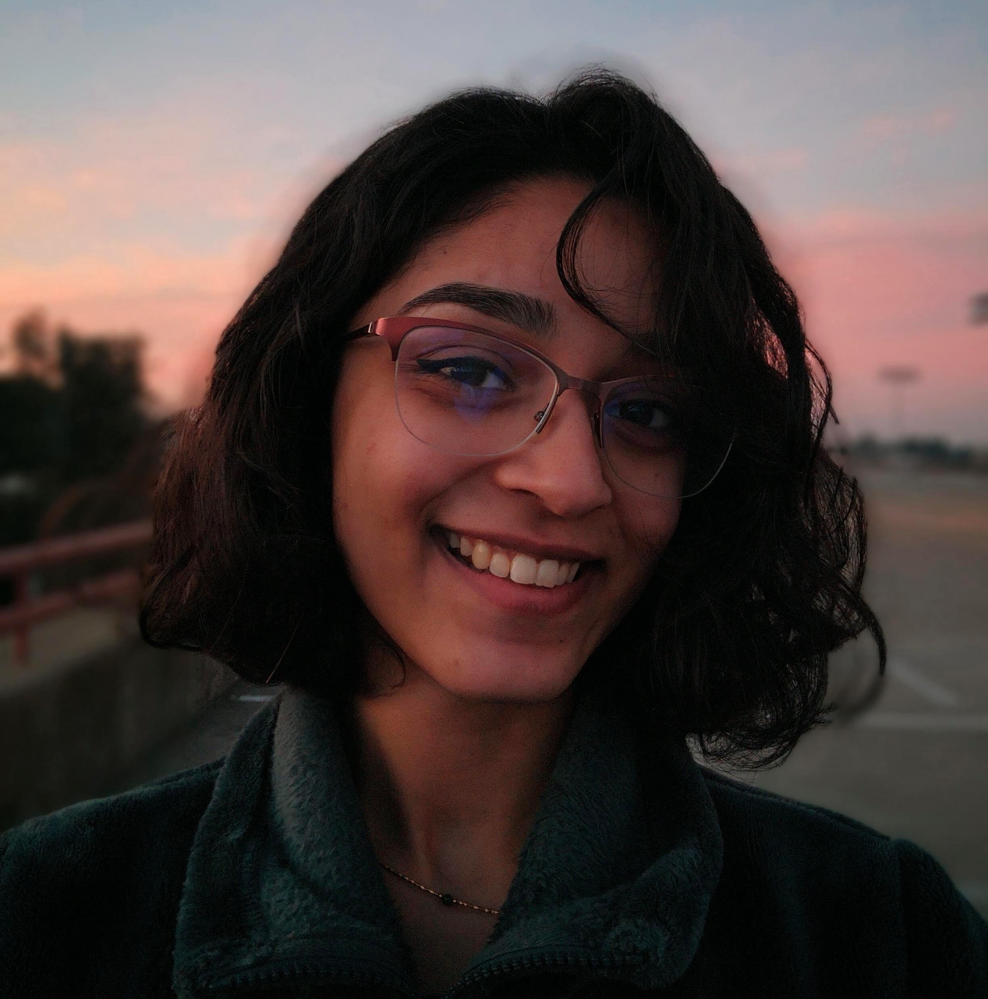
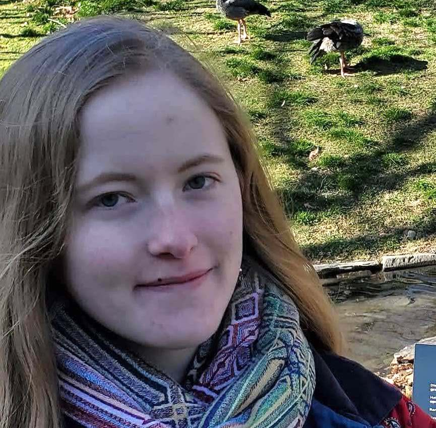
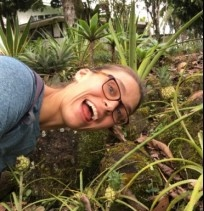

```{=html}
<script>
  (function(i,s,o,g,r,a,m){i['GoogleAnalyticsObject']=r;i[r]=i[r]||function(){
  (i[r].q=i[r].q||[]).push(arguments)},i[r].l=1*new Date();a=s.createElement(o),
  m=s.getElementsByTagName(o)[0];a.async=1;a.src=g;m.parentNode.insertBefore(a,m)
  })(window,document,'script','https://www.google-analytics.com/analytics.js','ga');

  ga('create', 'UA-5300959-3', 'auto');
  ga('send', 'pageview');

</script>
```
```{=html}
<style>
  .col2 {
    columns: 2 400px;         /* number of columns and width in pixels*/
    -webkit-column: 2 400px; /* chrome, safari */
    -moz-columns: 2 400px;    /* firefox */
  }
</style>
```
```{=html}
<style>
.forceBreak { -webkit-column-break-after: always; break-after: column; }
</style>
```
---
title: "People" 
---

## Current R-I Lab members

Please read more information on [joining the lab](prosp.html) and [lab expectations](expectations.html). <!-- break -->

<div class="col2">

::: {style="float: left"}

:::

**Brenda Cameron**\
(she/her)

Brenda is the lab manager and czar. In addition to working with us, she manages the [Bay](https://baylab.github.io), [Grosberg](http://www-eve.ucdavis.edu/grosberg/) and [Stachowicz](https://stachlab.wordpress.com) labs as well, and is an [award-winning](https://safetyservices.ucdavis.edu/safety-star-program) lab safety expert.

::: {style="float: left"}

:::

**Yu Cao** <a href="https://github.com/Caoyu819"></a> <a href="https://orcid.org/0000-0002-4682-7308"></a>  
(she/her)  

Yu is a joint postdoc with our collaborator [Ning Yang](https://scholar.google.com/citations?user=Eu-hz1EAAAAJ&hl=zh-CN) at HZAU. Yu is working on understanding the population and quantitative genetics of introgressed teosinte haplotypes in maize. 
<br/><br>

::: {style="float: left"}

:::

**Mackenzie Chun** <a href="https://www.linkedin.com/in/mackenzie-chun-4027982a9"></a>   
(she/her)  

Mackenzie is an EVE Scholar and a 2nd-year Stats/Anthro double major, working with Paulo Magalang on genome evolution and genetic variation in maize.


::: {style="float: left"}

:::

**Elli Cryan** <a href="https://www.linkedin.com/in/elli-cryan-a150ba121/"></a> <a href="https://twitter.com/https://twitter.com/cryan4plants"></a> <a href="https://orcid.org/0009-0006-8018-6686"></a>  
(she/her)  

Elli is a [Plant Biology](https://pbi.ucdavis.edu) graduate student coadvised by [Dan Kliebenstein](https://psfaculty.plantsciences.ucdavis.edu/kliebenstein/), working on the evolution of gene networks and the evolution of cross-incompatibility loci.
<br>

::: {style="float: left"}

:::

**Natasha Dhamrait** <a href="https://twitter.com/frondsrfriends"></a>\
(she/her)

Natasha is a student in the [Population Biology](https://pbg.ucdavis.edu) graduate group with interests including plant evolution, domestication, genome biology, and transposable elements.

::: {style="float: left"}

:::

**Regina Fairbanks** <a href="https://twitter.com/r_fairb?lang=en"></a> <a href="https://orcid.org/0000-0003-4485-0376"></a>  
(they/them)

Regina is a student in the [Population Biology](https://pbg.ucdavis.edu) graduate group, currently working on the population genetics and archaeology of the maize domestication locus *tga1*.
<br>

::: {style="float: left"}

:::

**Julia Harenčár** <a href="https://sites.google.com/view/juliaharencar"> </a><a href="https://www.linkedin.com/in/julia-harencar/"></a>  <a href="https://orcid.org/0000-0001-6944-4337"><a href="https://scholar.google.com/citations?user=U7ZRlZkAAAAJ&hl=en"></a>\
(she/her)

Julia is a [CPB](https://cpb.ucdavis.edu) and USDA postdoc coadvised by [Graham Coop](https://gcbias.org), [Jen Funk](https://funk.ucdavis.edu) and [Jenny Gremer](https://gremerlab.faculty.ucdavis.edu), working on climate adaptation and hybridization in California wild radishes.


::: {style="float: left"}

:::


**Forrest Li** <a href="https://www.linkedin.com/in/forrest-li/"></a> <a href="https://twitter.com/genomeofforrest"></a> <a href="https://github.com/liforrest6"></a> <a href="https://orcid.org/0000-0003-2965-2494"></a> <a href="https://scholar.google.com/citations?user=HSmh38QAAAAJ&hl=en"></a>\
(he/him)

Forrest is a graduate student in [Integrative Genetics and Genomics](https://igg.ucdavis.edu) working on climate adaptation in maize as part of a large international collaboration led by [CIMMYT](https://www.cimmyt.org). He is coadvised by [Dan Runcie](https://runcielab.ucdavis.edu).


::: {style="float: left"}
</a>
:::

**Beibei Liu**  <a href="https://twitter.com/beibeiliu13"></a>  <a href="https://orcid.org/0000-0003-1656-4954"></a> <a href="http://scholar.google.com/citations?user=yhHsL9gAAAAJ"></a>\
(she/her)

Beibei is a postdoc working on the evolution of transposable elements in maize and teosinte During her PhD she worked on epigenetics in maize.


::: {style="float: left"}
</a>
:::

**Paulo Magalang** <a href="https://www.linkedin.com/in/paulo-magalang-0b1468155/"> <a href="https://github.com/pmagalang"></a> \
(he/him)

Paulo is a graduate student in [Integrative Genetics and Genomics](https://igg.ucdavis.edu) working on using whole genome assemblies to study allelic diversity and demography in maize.
<br>

<!-- ::: {style="float: left"} -->
<!--  -->
<!-- ::: -->

<!-- **Sowmya Mambakkam**   -->
<!-- (she/her) -->

<!-- Sowmya is a senior Genetics and Genomics major. She has worked on inversions, convergent evolution, and is now studying associations between genes in maize and indigenous language.   -->

::: {style="float: left"}
 </a>
::: 

**Jeffrey Ross-Ibarra** <a href="https://rilab.ucdavis.edu"> </a> <a href="https://bsky.app/profile/jrossibarra.bsky.social"></a> <a href="http://github.com/rossibarra"></a> <a href="https://orcid.org/0000-0003-1656-4954"></a> <a href="https://github.com/rossibarra/CV"> <a href="http://scholar.google.com/citations?user=5SzRq1oAAAAJ"></a>\
(he/him)

Jeff is a Professor in the [Department of Evolution and Ecology](http://eve.ucdavis.edu) and a faculty member of the [Center for Population Biology](http://cpb.ucdavis.edu) and the [Genome Center](ttp://www.genomecenter.ucdavis.edu). He is also the Scientific Director of [HPC@UCD](https://hpc.ucdavis.edu/) 
<br>  

::: {style="float: left"}
</a>
:::

**Samantha Snodgrass**  <a href="https://twitter.com/snodgrasshopper"></a>  <a href="https://orcid.org/0000-0001-9209-6051"></a> <a href="http://scholar.google.com/citations?user=yhHsL9gAAAAJ"></a>\
(she/her)

Sam is an NSF Plant Genome postdoc working on the coevolution of humans and their domesticated plants. She is coadvised by [Graham Coop](http://gcbias.org).
<br><br>

::: {style="float: left"}
</a>
:::

**Cristian Stark **  <a href="https://www.linkedin.com/in/cristian-stark/"></a>  <a href="https://github.com/cstark14"></a>  
(he/him)

Cristian is a Genomics Data Scientist at Bayer Vegetables R&D and a PhD graduate student in [Integrative Genetics and Genomics](https://igg.ucdavis.edu) working on genomic selection, pangenomes, and inbreeding depression in *Zea*. He is coadvised by [Dan Runcie](https://runcielab.u4cdavis.edu).

::: {style="float: left"}
</a>
:::

**Natalie Veech**  <a href="https://www.linkedin.com/in/natalie-veech/"></a>
(she/her)

Natalie is a 3rd Year Environmental Science and Management Major and EVE Scholar working on machine learning approaches to study life history of radishes using herbarium specimens. She works closely with Julia Harenčár and is also a member of the [Gremer Lab](https://gremerlab.faculty.ucdavis.edu).


</div>


## Lab Alumni

- [Ayelet Salman-Minkov](https://scholar.google.com/citations?user=SWqRX4QAAAAJ&hl=en) Project Scientist 2023-2024
- [Alyssa Phillips](https://scholar.google.com/citations?user=p9u2mzwAAAAJ&hl=en) PhD student 2018-2024 (Postdoc UC Berkeley)
- [Garnet Phinney]() Undergraduate researcher, 2023-2024 (PhD Student UC Irvine)
- [Sarah Nicholson](https://scholar.google.com/citations?user=uQ7Z4PAAAAAJ&hl=en&oi=ao) PhD student 2016-2023
-   [Edwin Solares](https://www.linkedin.com/in/solarese) Postdoc 2021-2023 (Lecturer, UC Davis)
- [Miriam Nancy Salazar Vidal](https://scholar.google.com/citations?user=Ewa91LUAAAAJ&hl=en&oi=ao) Postdoc 2018-2023 (Research Scientist, U Missouri)
-   [Mitra Menon](https://scholar.google.com/citations?user=3Q2yL_MAAAAJ&hl=en) Postdoc 2020-2022 (Computational Biologist, Form Bio)
-   [Julianna Porter](https://github.com/juliannaporter) Postbac, 2021-2022 (PhD Student, UC Davis)
-   [Luke Sparreo](www.linkedin.com/in/luke-sparreo) Summer REU, 2022
-   [Asher Hudson](https://aihudson.github.io) PhD student, 2017-2022 (Postdoc, USDA NC State)
-   [Catherine Rushworth](https://www.cathyrushworth.org) Postdoc 2018-2022 (Asst. Prof, Utah State)
-   [Silas Tittes](https://scholar.google.com/citations?user=LxGAurUAAAAJ&hl=en): Postdoc 2018-2022 (Research Scientist, U Oregon)
-   [Robert Horvath](https://scholar.google.com/citations?user=U9evFmUAAAAJ&hl=en&oi=sra): Postdoc 2020-2021 (Postdoc, U. Zurich)
-   [Ning Yang](https://scholar.google.com/citations?user=Eu-hz1EAAAAJ&hl=zh-CN): Postdoc 2019-2021 (Professor, Huazhong Ag. University)
-   [Daniel Gates](https://danjgates.wordpress.com): Postdoc 2016-2020 (Bioinformatician, Checkerspot)
-   [Taylor Perkins](https://orcid.org/0000-0002-1076-0527): Lab Manager 2019-2020
-   [Sarah Turner-Hissong](https://mishaploid.github.io): Postdoc 2019-2020 (Research Scientist, Bayer Crop Sci.)
-   [Michelle Stitzer](http://mcstitzer.github.io) PhD student 2013-2019 (NSF Postdoc, Cornell)
-   [Dianne Velasco](https://scholar.google.com/citations?user=h2_YtiYAAAAJ&hl=en) PhD Student 2010-2019 (USDA-ARS National Clonal Germplasm Repository)
-   [Li Wang](https://scholar.google.com/citations?user=yGEvdz0AAAAJ&hl=en): Postdoc 2018-2019 (Research Scientist, Agricultural Genomics Institute Shenzhen)
-   [Markus Stetter](https://www.cropevolution.org): Postdoc 2017-2019 (Asst. Group Leader, U. Köln)
-   [Wenbin Mei](https://scholar.google.com/citations?user=LR1KOxwAAAAJ&hl=en): Postdoc 2016-2018 (Scientist at Inari Agriculture)
-   [Anne Lorant](https://scholar.google.com/citations?user=mnHb3lYAAAAJ&hl=en): Lab manager, PhD student, postdoc 2013-2018 (Bioinformatician, LBMCC)
-   [Emily Josephs](https://josephslab.github.io): Postdoc 2015-2018 (Asst. Professor, MSU)
-   [Luis Avila](https://lmavila.github.io): Programmer 2016-2018 (Research Scientist, Genentech)
-   [Anna O'Brien](https://annamobrien.wordpress.com): PhD Student 2011-2017 (Postdoc, U. Toronto)
-   [Jinliang Yang](http://jyanglab.com): Postdoc 2014-2017 (Assistant Professor, U. Nebraska)
-   [Josh Hough](https://scholar.google.fr/citations?user=FmClXYIAAAAJ&hl=en): Postdoc 2016-2017
-   [Paul Bilinski](https://scholar.google.com/citations?user=c03DwHkAAAAJ&hl=en): PhD Student 2010-2016 (Associate Professor, West Shore Community College)
-   [Simon Renny-Byfield](https://scholar.google.com/citations?hl=en&user=uZTFIaAAAAAJ): Postdoc 2014-2016 (Research Scientist, Corteva Agriscience)
-   [Kate Crosby](https://github.com/kate-crosby): Postdoc 2014-2015 (Research Scientist, Indigo Ag)
-   Sayuri Tsukahara: Postdoc 2013-2015
-   [Tim Beissinger](https://www.uni-goettingen.de/en/599788.html): Postdoc 2014-2015 (Professor, U. Göttingen)
-   [Arun Durvasula](https://arundurvasula.wordpress.com): Undergraduate 2013-2015 (PhD Student, UCLA)
-   Nivaz Brar: Undergraduate 2014-2015
-   [Chris Fiscus](https://cjfiscus.github.io/): Undergraduate 2014 (PhD Student, UC Riverside)
-   [Tyler Kent](https://github.com/tvkent): Undergraduate 2013-2015 (PhD Student, U. Toronto)
-   [Vince Buffalo](http://www.vincebuffalo.com): Programmer 2013-2014 (Postdoc, U Oregon)
-   [Sofiane Mezmouk](http://www.linkedin.com/pub/sofiane-mezmouk/6b/a35/a34): Postdoc 2012-2014 (Research Scientist, KWS)
-   [Shohei Takuno](https://sites.google.com/site/shoheitakuno/): Postdoc 2012-2013 (Asst. Professor, SOKENDAI)
-   [Matthew Hufford](http://www.public.iastate.edu/~mhufford/HuffordLab/home.html): Postdoc 2010-2013 (Assoc. Professor, Iowa State)
-   [Tanja Pyhäjärvi](https://www2.helsinki.fi/en/researchgroups/forest-genomics): Postdoc 2010-2012 (Associate Professor, U. Helsinki)
-   [Joost van Heerwaarden](http://www.wageningenur.nl/en/Persons/dr.ir.-J-Joost-van-Heerwaarden.htm): Postdoc 2009-2011 (Researcher, U. Wageningen)

### Visiting Scholar: for \>100 hours of scholastic visitation

-   [Andi Kur](https://www.instagram.com/andi_kur_art/?hl=en)
-   [Azalea Guerra García](http://www.fciencias.unam.mx/directorio/57770)
-   [Kelly Dawe](http://www.dawelab.org)\
-   [Rute Fonseca](http://rutefonseca.wix.com/bioinformatics)
-   [Eric Fuchs](https://sites.google.com/site/ejfuchs/)
-   [Peter Morrell](http://faculty.agronomy.cfans.umn.edu/pmorrell/)
-   [Chad Niederhuth](http://niederhuthlab.com)
-   [Ginnie Morrison](http://www.panzea.org/#!ginnie-morrison/c1lov)
-   [Markus Stetter](http://mstetter.github.io)
-   [Sivan Yair](https://scholar.google.com/citations?user=Ru46Ih4AAAAJ&hl=en)

### Fellow of the R-I Lab: for \>500 hours of scholastic fellowship

-   [Peter Tiffin](http://www.cbs.umn.edu/lab/tiffin)
-   [Leo Zeitler](https://www.researchgate.net/profile/Leo_Zeitler)

### Current Collaborators

**Genetic diversity in maize and teosinte**

-   [Jianbing Yan](http://maizego.org)\
-   [Ning Yang](http://maizego.org)

**Identifying environmentally adaptive alleles for breeding**

-   [Daniel Runcie](https://runcielab.ucdavis.edu)
-   [CIMMYT](https://www.cimmyt.org)
<!-- **Evolution of Incompatibility Loci in Maize and Teosinte** -->

<!-- -   [Matt Evans](https://carnegiescience.edu/scientist/matthew-evans)\ -->
<!-- -   [Yaniv Brandvain](https://brandvainlab.wordpress.com) -->

<!-- **Quantitative Genetics of Genotype x Environment Interaction** -->

<!-- -   [Dan Runcie](http://runcielab.ucdavis.edu/)\ -->
<!-- -   [Limagrain](https://www.limagrain.com/?lang=en) -->

<!-- **Evolutionary Genetics of Transposable Elements** -->

<!-- -   [Nathan Springer](https://cbs.umn.edu/springer-lab/home) -->
<!-- -   [Candice Hirsch](http://hirschlab.cfans.umn.edu) -->
<!-- -   [Emily Josephs](https://josephslab.github.io) -->
<!-- -   [Shawn Kaeppler](https://agronomy.wisc.edu/shawn-kaeppler/) -->

<!-- **Convergent Evolution in the Andropogoneae** -->

<!-- -   [Toby Kellogg](http://kellogglab.weebly.com)\ -->
<!-- -   [Adam Siepel](http://compgen.cshl.edu/~acs/)\ -->
<!-- -   [Matthew Hufford](http://www.public.iastate.edu/~mhufford/HuffordLab/home.html) -->
<!-- -   [Qi Sun](http://vivo.cornell.edu/display/individual24418)\ -->
<!-- -   [Ed Buckler](http://www.maizegenetics.net) -->

<!-- **Evolutionary genetics of highland adaptation in maize** -->

<!-- -   [Graham Coop](https://gcbias.org) -->
<!-- -   [Sherry Flint-Garcia](http://web.missouri.edu/~flint-garcias/) -->
<!-- -   [Matthew Hufford](http://www.public.iastate.edu/~mhufford/HuffordLab/home.html) -->
<!-- -   [Ruben Rellan-Alvarez](http://www.rrlab.org) -->
<!-- -   [Dan Runcie](http://runcielab.ucdavis.edu/) -->
<!-- -   [Ruairidh Sawers](http://www.langebio.cinvestav.mx/?pag=165) -->
