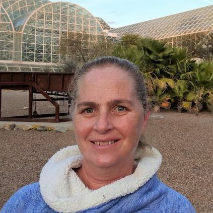
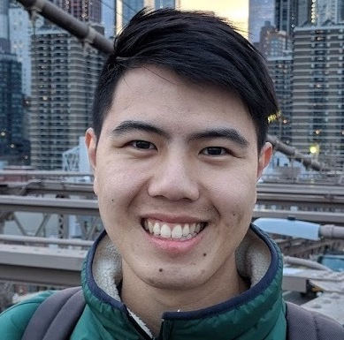

---
title: "People" 
---

## Current R-I Lab members
Please read more information on [joining the lab](prosp.html) and [lab expectations](expectations.html).
<!-- break -->

  
<!-- break -->

  
</a>

 

**Brenda Cameron**  
(she/her/hers)

Brenda is the lab manager and czar. In addition to working with us, she manages the  [Bay](https://baylab.github.io),  [Grosberg](http://www-eve.ucdavis.edu/grosberg/) and [Stachowicz](https://stachlab.wordpress.com) labs as well, and is an [award-winning](https://safetyservices.ucdavis.edu/safety-star-program) lab safety expert.
<!-- break -->
   
<!-- break -->

  
</a>

 

**Elli Cryan** 
   
(she/her/hers)  

Elli is a [Plant Biology](https://pbi.ucdavis.edu) graduate student coadvised by [Dan Kliebenstein](https://psfaculty.plantsciences.ucdavis.edu/kliebenstein/), working on the evolution of gene networks.  
<!-- break -->
 
<!-- break -->

  
</a>

  
**Regina Fairbanks**   
(they/them/theirs)  

Regina is a first year student in the [Population Biology](https://pbg.ucdavis.edu) graduate group with interests including archaeology, genomics, and plant domestication.
<!-- break -->
  
<!-- break -->

</a>

**Forrest Li**

  
(he/him/his)  

Forrest is a graduate student in [Integrative Genetics and Genomics](https://igg.ucdavis.edu) working on climate adaptation in maize as part of  a large international collaboration led by [CIMMYT](https://www.cimmyt.org). 
  

</a>

**Mitra Menon** 

  
(she/her/hers)  

Mitra is a postdoctoral fellow working on the evolutionary genetics of TEs. Her previous work focuserd on ecological and evolutionary genomics of conifers.

<!-- break -->
 
<!-- break -->

</a>

**Sarah Odell** 

  
(she/her/hers)  

Sarah is a [Plant Biology](https://pbi.ucdavis.edu)  graduate student coadvised by [Dan Runcie](http://runcielab.ucdavis.edu), working on evolutionary and statistical genetics in maize.  
<!-- break --> 
 

<!-- break --> 

</a>

**Alyssa Phillips** 

  
(she/her/hers)  

Alyssa is a [Plant Biology](https://pbi.ucdavis.edu) graduate student working on environmental adaptation in big blue stem as part of the [PanAnd project](https://panandropogoneae.com).  
<!-- break -->
 
<!-- break -->

</a>

**Julianna Porter** 
  
(she/her/hers)  

Julianna is an  [Genetics & Genomics](https://www.ucdavis.edu/majors/genetics-and-genomics) major and the recipient  of the Nieland Family Award to  do  independennt research on  adapation in *Tripsacum*  as part of the   [PanAnd project](https://panandropogoneae.com).  .

<!-- break -->
 
<!-- break -->

</a>

**Jeffrey Ross-Ibarra**  

<a href="https://github.com/rossibarra/CV">
 
(he/him/his)  

Jeff is a Professor in the [Department of Evolution and Ecology](http://eve.ucdavis.edu) and a faculty member of the [Center for Population Biology](http://cpb.ucdavis.edu) and the [Genome Center](ttp://www.genomecenter.ucdavis.edu).   
<!-- break -->
  
<!-- break -->

</a>

**Defne Sime**
  
(she/her/hers)  

Defne is an undergraduate working with Mitra to udnerstand how indigenous language groups may have structured genetic diversity in traditional maize landraces.

<!-- break -->
 
<!-- break -->

</a>

**Edwin Solares** 

  
(he/him/his)  

Edwin is a [UC President's Postdoctoral Fellow](https://ppfp.ucop.edu/info/index.html) interested in applying computational solution to problems in genetics and genomics.  
<!-- break -->
 
<!-- break -->

## Lab Alumni

* [Asher Hudson](https://aihudson.github.io) PhD student, 2017-2022 (Postdoc, USDA NC State)
* [Catherine Rushworth](https://www.cathyrushworth.org) Postdoc 2018-2022 (Asst. Prof, U. Utah)
* [Silas Tittes](https://scholar.google.com/citations?user=LxGAurUAAAAJ&hl=en): Postdoc 2018-2022 (Research Scientist, U Oregon)
* [Robert Horvath](https://scholar.google.com/citations?user=U9evFmUAAAAJ&hl=en&oi=sra): Postdoc 2020-2021 (Postdoc, U. Zurich)
* [Ning Yang](https://scholar.google.com/citations?user=Eu-hz1EAAAAJ&hl=zh-CN): Postdoc 2019-2021 (Professor, Huazhong Ag. University)
* [Daniel Gates](https://danjgates.wordpress.com): Postdoc 2016-2020 (Bioinformatician, Checkerspot)
* [Taylor Perkins](https://orcid.org/0000-0002-1076-0527): Lab Manager 2019-2020 
* [Sarah Turner-Hissong](https://mishaploid.github.io): Postdoc 2019-2020 (Research Scientist, Bayer Crop Sci.)
* [Michelle Stitzter](http://mcstitzer.github.io) PhD student 2013-2019 (NSF Postdoc, Cornell)
* [Dianne Velasco](https://scholar.google.com/citations?user=h2_YtiYAAAAJ&hl=en) PhD Student 2010-2019 (USDA-ARS National Clonal Germplasm Repository)
* [Li Wang](https://scholar.google.com/citations?user=yGEvdz0AAAAJ&hl=en): Postdoc 2018-2019 (Research Scientist, Agricultural Genomics Institute Shenzhen)
* [Markus Stetter](https://www.cropevolution.org): Postdoc 2017-2019 (Asst. Group Leader, U. Köln)
* [Wenbin Mei](https://scholar.google.com/citations?user=LR1KOxwAAAAJ&hl=en): Postdoc 2016-2018 (Scientist at Inari Agriculture)
* [Anne Lorant](https://scholar.google.com/citations?user=mnHb3lYAAAAJ&hl=en): Lab manager, PhD student, postdoc 2013-2018 (Postdoc, UC Davis)
* [Emily Josephs](https://josephslab.github.io): Postdoc 2015-2018 (Asst. Professor, MSU)
* [Luis Avila](https://lmavila.github.io): Programmer 2016-2018 (Research Scientist, Genentech)
* [Anna O'Brien](https://annamobrien.wordpress.com): PhD Student 2011-2017 (Postdoc, U. Toronto)
* [Jinliang Yang](http://jyanglab.com): Postdoc 2014-2017 (Assistant Professor, U. Nebraska)
* [Josh Hough](https://scholar.google.fr/citations?user=FmClXYIAAAAJ&hl=en): Postdoc 2016-2017 
* [Paul Bilinski](https://scholar.google.com/citations?user=c03DwHkAAAAJ&hl=en): PhD Student 2010-2016 (Associate Professor, West Shore Community College)
* [Simon Renny-Byfield](https://scholar.google.com/citations?hl=en&user=uZTFIaAAAAAJ): Postdoc 2014-2016 (Research Scientist, Corteva Agriscience)
* [Kate Crosby](https://github.com/kate-crosby): Postdoc 2014-2015 (Research Scientist, Indigo Ag)
* Sayuri Tsukahara: Postdoc 2013-2015
* [Tim Beissinger](https://www.uni-goettingen.de/en/599788.html): Postdoc 2014-2015 (Professor, U. Göttingen)
* [Arun Durvasula](https://arundurvasula.wordpress.com): Undergraduate 2013-2015 (PhD Student, UCLA)
* Nivaz Brar: Undergraduate 2014-2015
* [Chris Fiscus](https://cjfiscus.github.io/): Undergraduate 2014 (PhD Student, UC Riverside)
* [Tyler Kent](https://github.com/tvkent): Undergraduate 2013-2015 (PhD Student, U. Toronto)
* [Vince Buffalo](http://www.vincebuffalo.com): Programmer 2013-2014  (Postdoc, U Oregon)
* [Sofiane Mezmouk](http://www.linkedin.com/pub/sofiane-mezmouk/6b/a35/a34): Postdoc 2012-2014 (Research Scientist, KWS)
* [Shohei Takuno](https://sites.google.com/site/shoheitakuno/): Postdoc 2012-2013 (Asst. Professor, SOKENDAI)
* [Matthew Hufford](http://www.public.iastate.edu/~mhufford/HuffordLab/home.html): Postdoc 2010-2013 (Assoc. Professor, Iowa State)
* [Tanja Pyhäjärvi](https://www2.helsinki.fi/en/researchgroups/forest-genomics): Postdoc 2010-2012 (Associate Professor, U. Helsinki)
* [Joost van Heerwaarden](http://www.wageningenur.nl/en/Persons/dr.ir.-J-Joost-van-Heerwaarden.htm): Postdoc 2009-2011 (Researcher, U. Wageningen)

### Visiting Scholar: for >100 hours of scholastic visitation

* [Andi Kur](https://www.instagram.com/andi_kur_art/?hl=en)
* [Azalea Guerra García](http://www.fciencias.unam.mx/directorio/57770)
* [Kelly Dawe](http://www.dawelab.org)  
* [Rute Fonseca](http://rutefonseca.wix.com/bioinformatics)
* [Eric Fuchs](https://sites.google.com/site/ejfuchs/) 
* [Peter Morrell](http://faculty.agronomy.cfans.umn.edu/pmorrell/)
* [Chad Niederhuth](http://niederhuthlab.com)
* [Ginnie Morrison](http://www.panzea.org/#!ginnie-morrison/c1lov)
* [Markus Stetter](http://mstetter.github.io)
* [Sivan Yair](https://scholar.google.com/citations?user=Ru46Ih4AAAAJ&hl=en)

### Fellow of the R-I Lab: for >500 hours of scholastic fellowship

* [Peter Tiffin](http://www.cbs.umn.edu/lab/tiffin)
* [Leo Zeitler](https://www.researchgate.net/profile/Leo_Zeitler)

### Current Collaborators

**Genetic diversity in maize and teosinte**
* [Jianbing Yan](http://maizego.org)
* [Ning Yang](http://maizego.org)

**Evolution of Incompatibility Loci in Maize and Teosinte**  

* [Matt Evans](https://carnegiescience.edu/scientist/matthew-evans)  
* [Yaniv Brandvain](https://brandvainlab.wordpress.com)  

**Quantitative Genetics of Genotype x Environment Interaction**  

* [Dan Runcie](http://runcielab.ucdavis.edu/)  
* [Limagrain](https://www.limagrain.com/?lang=en)  

**Evolutionary Genetics of Transposable Elements**  

* [Nathan Springer](https://cbs.umn.edu/springer-lab/home)
* [Candice Hirsch](http://hirschlab.cfans.umn.edu)
* [Emily Josephs](https://josephslab.github.io)
* [Shawn Kaeppler](https://agronomy.wisc.edu/shawn-kaeppler/)

**Convergent Evolution in the Andropogoneae**  

* [Toby Kellogg](http://kellogglab.weebly.com)  
* [Adam Siepel](http://compgen.cshl.edu/~acs/)  
* [Matthew Hufford](http://www.public.iastate.edu/~mhufford/HuffordLab/home.html)
* [Qi Sun](http://vivo.cornell.edu/display/individual24418)  
* [Ed Buckler](http://www.maizegenetics.net)

**Evolutionary genetics of highland adaptation in maize**

* [Graham Coop](https://gcbias.org)
* [Sherry Flint-Garcia](http://web.missouri.edu/~flint-garcias/)
* [Matthew Hufford](http://www.public.iastate.edu/~mhufford/HuffordLab/home.html)
* [Ruben Rellan-Alvarez](http://www.rrlab.org)
* [Dan Runcie](http://runcielab.ucdavis.edu/)
* [Ruairidh Sawers](http://www.langebio.cinvestav.mx/?pag=165)

