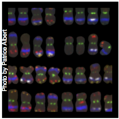

## Research

### Genetics of adaptation

Maize spread rapidly after domestication, adapting to a wide range of environments.
Today maize is grown across a broader geographic breadth than any of the world's other staple crops, from sea level to altitudes of $>4,000$m and from deserts to near-flooded conditions. The wild relatives of maize have also adapted to environments varying widely in elevation, temperature, and moisture availability. Our previous work has shown that adaptation in teosinte is often restricted to discrete local populations and has often made use of regulatory variation.
We also find evidence that inversion polymorphisms are common and associated with environmental gradients and phenotypic variation. Because maize -- and likely other complex plant genomes -- can apparently circumvent cytological problems associated with large-scale structure variation, we suspect such variants are common in plant genomes. Work is underway both to characterize the genomic and phenotypic effects of individual inversions and to more broadly characterize the scope of structural variation within natural populations using both resequencing and *de novo* genome assembly.

In many instances of local adaptation, independent populations have converged on similar phenotypic adaptations.  We have worked with maize populations adapted to high elevation environments in Mexico and South America, seeking to understand whether convergent phenotypic evolution is associated with convergent changes at the molecular level. Our previous efforts pointed to a key role for adaptive introgression from wild teosinte in enabling maize to adapt to the mountains of central Mexico, but in spite of similar phenotypes we find no overlap between Mexican and Andean populations in genes showing evidence of selection. Our analyses further suggest that most local adaptation in these populations has not been mutation limited, but that instead stochastic differences in local founding populations, each with abundant standing genetic variation, likely explain the lack of convergent genetics.

* [Evolutionary responses to conditionality in species interactions across environmental gradients](http://biorxiv.org/content/early/2017/03/01/031195)    
**O'Brien AM**, Sawers RJH, **Ross-Ibarra J**, Strauss SY 

* [Independent molecular basis of convergent highland adaptation in maize](http://www.genetics.org/content/200/4/1297)
**Takuno S**, Ralph P,  Swarts K, Elshire RJ, Glaubitz JC, Buckler ES, **Hufford MB**, **Ross-Ibarra J**.   

* [The origin and evolution of maize in the American Southwest](http://www.rilab.org/pdfs/fonseca2015.pdf)  
Fonseca RR, Smith B, Wales N, Cappellini E ...[12 authors]... Hufford MB, Albrechtsen A, **Ross-Ibarra J**, Gilbert MT.  

* [Maize diversity associated with social origin and environmental variation in southern Mexico](http://www.nature.com/hdy/journal/vaop/ncurrent/full/hdy201610a.html)

* [Advances and limits of using population genetics to understand local adaptation](http://www.rilab.org/pdfs/tiffin2014.pdf)  
Tiffin P, **Ross-Ibarra J**  

* [Complex patterns of local adaptation in teosinte](http://gbe.oxfordjournals.org/content/5/9/1594)  
**Pyhäjärvi T**, **Hufford MB**, **Mezmouk S**, **Ross-Ibarra J**   

* [The genomic signature of crop-wild introgression in maize](http://www.plosgenetics.org/article/info%3Adoi%2F10.1371%2Fjournal.pgen.1003477)   
**Hufford MB**, Lubinsky P, **Pyhäjärvi T**, **Devengenzo MT**, Ellstrand NC, **Ross-Ibarra J**  

* [Diversity and abundance of the Abnormal chromosome 10 meiotic drive complex in *Zea mays*](http://www.nature.com/hdy/journal/vaop/ncurrent/full/hdy20132a.html)  
Kanizay LB, **Pyhäjärvi T**, Lowry E, **Hufford MB**, Peterson DG, **Ross-Ibarra J**, Dawe RK  

* [Megabase-scale inversion polymorphism in the wild ancestor of maize](http://www.genetics.org/content/191/3/883.abstract)  
Fang Z, **Pyhäjärvi T**, Weber AL, Dawe RK, Glaubitz JC, Sianchez Gonzalez J, **Ross-Ibarra C**, Doebley J, Morrell PL, **Ross-Ibarra J**

* [Teosinte as a model system for population and ecological genomics](http://www.rilab.org/pdfs/hufford2012.pdf)  
**Hufford MB**, **Bilinski P**, **Pyhäjärvi T**, **Ross-Ibarra J**  

* [Fine scale genetic structure in the wild ancestor of maize (**Zea mays** ssp. **parviglumis**)](http://www.rilab.org/pdfs/Van-Heerwaarden-et-al-2010-951.pdf)  
**van Heerwaarden J**, **Ross-Ibarra J**, Doebley J, Glaubitz JC, Sanchez Gonzalez J, Gaut BS, Eguiarte LE  

* [Influence of cryptic population structure on observed mating patterns in the wild progenitor of maize](http://www.rilab.org/pdfs/hufford2011.pdf)  
**Hufford MB**, Gepts P, **Ross-Ibarra J**  

### Experimental Evolution

Plant domestication and modern breeding represent examples of experimentally evolved populations. Studying these populations provides an opportunity to understand not only the genetic basis of evolutionary change but also how the processes of evolution interact to shape modern genetic and phenotypic diversity.

We have worked to understand selection during domestication, documenting its polygenic nature, the contributions of regulatory variation, and the importance of processes such as convergent molecular evolution  and selection on standing genetic variation.
Our detailed analyses of  inbred lines have revealed little evidence for strong selection during modern maize breeding, instead highlighting the effect of small population sizes in partitioning diversity into distinct populations of increasingly narrow ancestry.

Our current work on domestication focuses on how demographic change interacts with selection to shape genetic and phenotypic diversity.
Maize underwent a demographic bottleneck during domestication, reducing its effective population size and thus the efficacy of purifying selection.
Purifying selection in teosinte is thus stronger due to its larger effective population size, resulting in both a deeper and wider valley of diversity around conserved genes.
But maize population size grew quickly after domestication, eventually exceeding that of teosinte.
New mutations in maize are thus subject to stronger selection than in teosinte, a shift reflected in patterns of variation in recent low frequency variants such as singleton polymorphisms.   
Population demographic change can also impact the effect size, number, and dominance of loci underlying phenotypic traits .
Our future work will utilize data from large-scale association mapping studies, coupled with population genomic inference of demographic change and selection, to study how the process of domestication may have shaped the genetic architecture of phenotypic traits.

Building on our work highlighting the importance of deleterious alleles in phenotypic variation, we have used experimentally evolved populations to track haplotype frequencies over time and assess the genetic basis of gain in hybrid yield. Our recent analysis finds little overlap in selected haplotypes between two populations bred for increasing hybrid yield, consistent with a model for complementation of deleterious variants brought to high frequency by hitchhiking.
Current efforts include work to build a pedigree of more than 4,000 maize lines with which to extend these haplotype analyses across many populations.  

* [Incomplete dominance of deleterious alleles contribute substantially to trait variation and heterosis in maize](http://biorxiv.org/content/early/2016/11/07/086132)  
**Yang J**, **Mezmouk S**, Baumgarten A, Buckler ES, Guill KE, McMullen MD, Mumm RH, **Ross-Ibarra J**

* [The interplay of demography and selection during maize domestication and diffusion ](http://www.google.com/url?q=http%3A%2F%2Fbiorxiv.org%2Fcontent%2Fearly%2F2017%2F03%2F07%2F114579&sa=D&sntz=1&usg=AFQjCNHr4cDzAxS_7BXVZOfyuIWzXiHr0w)  

* [Genome sequence of a 5310-year-old maize cob provides insights into the early stages of maize domestication](<http://www.cell.com/current-biology/abstract/S0960-9822(16)31120-4>)  

* [The origin and evolution of maize in the American Southwest](http://rdcu.be/kHD8) 

* [Natural variation in teosinte at the domestication locus teosinte branched1 (tb1)](https://peerj.com/articles/900/) 
* [Evolutionary genomics of peach and almond domestication](http://www.g3journal.org/content/6/12/3985.short?rss=1&ssource=mfr)

* [The genomic impacts of drift and selection for hybrid performance in maize](https://www.google.com/url?sa=t&rct=j&q=&esrc=s&source=web&cd=2&cad=rja&uact=8&ved=0CC0QFjABahUKEwiY8ezQoa3IAhWRL4gKHYbZCYU&url=http%3A%2F%2Fwww.genetics.org%2Fcontent%2Fearly%2F2015%2F09%2F18%2Fgenetics.115.182410.abstract&usg=AFQjCNF6HUbfJ3ij4yqX75WFIP7h0VqD8g&sig2=7Gw1t6U1cc7imLVZEUWlHQ)

* [Seed filling in domesticated maize and rice depends on SWEET-mediated hexose transport](http://www.nature.com.sci-hub.bz/ng/journal/v47/n12/full/ng.3422.html)     

* [Genetic, evolutionary and plant breeding insights from the domestication of maize](http://elifesciences.org/content/4/e05861)  
Hake S, **Ross-Ibarra J**.   

* [The pattern and distribution of deleterious mutations in maize](http://www.g3journal.org/content/4/1/163.full)

* [From many, one: genetic control of prolificacy during maize domestication](http://www.plosgenetics.org/article/info%3Adoi%2F10.1371%2Fjournal.pgen.1003604)  
Wills DM, Whipple C, **Takuno S**, Kursel LE, Shannon LM, **Ross-Ibarra J**, Doebley JF.  

* [Comprehensive analysis of imprinted genes in maize reveals allelic variation and limited conservation with other species](http://www.pnas.org/content/110/48/19639.abstract)

* [Comparative population genomics of maize domestication and improvement](http://media.wix.com/ugd/fe9228_24240aa930bf4728be83b4b57da55f17.pdf)  
**Hufford MB**, Xun X, **van Heerwaarden J**, **Pyhäjärvi T** ...[17 authors]... Ware D, Buckler ES, Yang S, **Ross-Ibarra J**  

* Cook JP, McMullen MD, Holland JB, Tian F, Bradbury P, **Ross-Ibarra J**, Buckler ES, Flint-Garcia SA (2012) [Genetic architecture of maize kernel composition in the Nested Association Mapping and Inbred Association panels](http://www.plantphysiol.org/content/158/2/824.full). 

* **van Heerwaarden J**, **Hufford MB**, **Ross-Ibarra J** (2012) [Historical genomics of North American maize](http://www.pnas.org/content/early/2012/07/12/1209275109). 

* [Reshaping of the maize transcriptome by domestication](http://www.rilab.org/pdfs/swansonwagner2012.pdf)  
Swanson-Wagner R, Briskine R, Schaefer R, **Hufford MB**, **Ross-Ibarra J**, Myers CL, Tiffin P, Springer NM     

* [Identification of a functional transposon insertion in the maize domestication gene *tb1*](http://media.wix.com/ugd/fe9228_14630f30e97f4e04b8b5980632002f7a.pdf)  
Studer A, Zhao Q, **Ross-Ibarra J**, Doebley J  

* [Genetic signals of origin, spread and introgression in a large sample of maize landraces](http://media.wix.com/ugd/fe9228_4916e7f7acec4aee869da040d519e0be.pdf)  
**van Heerwaarden J**, Doebley J, Briggs WH, Glaubitz JC, Goodman MM, Sanchez Gonzalez JJ, **Ross-Ibarra J**   

* [Genetic diversity in a crop metapopulation](http://www.nature.com/hdy/journal/v104/n1/full/hdy2009110a.html)  
**van Heerwaarden J**, van Eeuwijk FA, **Ross-Ibarra J**   

* [Historical divergence and gene flow in the genus Zea](http://www.genetics.org/content/181/4/1399.abstract)  
**Ross-Ibarra J**, Tenaillon M, Gaut BS  

* [A first-generation haplotype map of maize](http://media.wix.com/ugd/fe9228_352f4ee9b69a425589e55a4bac60bc5d.pdf)  
Gore MA, Chia JM, Elshire RJ, Sun Q ...[4 authors]... Grills GS, **Ross-Ibarra J**, Ware DH, Buckler ES  

* [Multiple domestications do not appear monophyletic](http://www.ncbi.nlm.nih.gov/pmc/articles/PMC2614810/)   
**Ross-Ibarra J**, Gaut BS  

* [Plant domestication, a unique opportunity to identify the genetic basis of adaptation](http://www.ncbi.nlm.nih.gov/pmc/articles/PMC1876441/)  
**Ross-Ibarra J**, Morrell PL, Gaut BS  

* [Quantitative trait loci and the study of plant domestication](http://www.rilab.org/pdfs/Ross-Ibarra-2005-15881692.pdf)  
**Ross-Ibarra J** (2005)  

* [The evolution of recombination under domestication: a test of two hypotheses](http://www.rilab.org/pdfs/Ross-Ibarra-2004.pdf)  
**Ross-Ibarra J**  

### Genome Evolution

In addition to discerning the genetic basis of phenotypic evolution, we are interested in  understanding the processes that shape evolution of the genome itself.
We have shown that differences in deletion bias can effect large changes in genome size over phylogenetic time scales and documented extensive variation in copy number across diverse maize and teosinte.
Current work characterizing copy number variation in a single wild population of teosinte has revealed problems with population genetic methods that are unable to account for biologically missing data.
Statistics such as Tajima's D, for example, show a strong correlations with the frequency of deletions,  potentially leading to false interpretations of selection or demographic change.

To better understand processes shaping genome evolution across populations, we are currently working to model genome size as a phenotype.
We have developed methods to quantify the abundance of different repetitive fractions of the genome and test for selection on repeat abundance.
Our initial results find evidence that overall genome size  and heterochromatic knob abundance  both are under selection for smaller genomes across altitudinal gradients, perhaps as a means of accelerating development and flowering.

While transposable elements (TEs) as a group do not appear to be under selection for genome size variation, they nonetheless make up the majority of most flowering plant genomes.
We have previously shown important functional consequences of individual TE insertions on phenotype and gene expression, but we are just beginning to understand their genome-wide significance.
Methods developed in other model organisms invariably fail to detect TE insertions in complex genomes such as maize, but we have developed approaches that take advantage of our *de novo* hand-curated annotation of TEs to accurately identify insertions in high-coverage resequencing data.
TE polymorphism is abundant: individual lines contain hundreds of thousands of new insertions, including thousands of insertions into protein-coding genes.
Analysis across a small set of lines has already revealed the impact of new insertions on gene expression and strong differences in insertion preference, methylation state, and allele frequency among different TE families.
We aim to expand these analyses to include population genetic methods to identify selection on individual insertions, thus enabling us to better understand the role TEs play in driving genomic change and potentially adaptation in both natural and domesticated populations.

* [The complex sequence landscape of maize revealed by single molecule technologies](http://biorxiv.org/content/early/2016/12/19/079004)  

* [Construction of the third generation Zea mays haplotype map](http://biorxiv.org/content/early/2015/09/16/026963)   
  Bukowski R ...[16 authors]...  **Ross-Ibarra J**, **Buffalo V**, Buckler ES, Xu Y,  Lai J, Ware D, Sun Q 

* [Gene fractionation and function in the ancient subgenomes of maize](http://biorxiv.org/content/early/2016/12/19/095547)  

* [Diverse origins of high copy tandem repeats in grass genomes](https://peerj.com/preprints/2314/)    

* [Transposable Elements Contribute to Activation of Maize Genes in Response to Abiotic Stress](http://www.plosgenetics.org/article/info%3Adoi%2F10.1371%2Fjournal.pgen.1004915)  
Makarevitch I, Waters M, West P, **Stitzer M**, **Ross-Ibarra J**, Springer NM.  

*  [High quality maize centromere 10 sequence reveals evidence of frequent recombination events](http://journal.frontiersin.org/article/10.3389/fpls.2016.00308/full)  

* [Diversity and evolution of centromere repeats in the maize genome](http://rilab.org/pdfs/Bilinski2014.pdf)  
**Bilinski P**, **Distor KD**, **Gutierez-Lopez J**, **Mendoza Mendoza G**, Shi J, Dawe K, **Ross-Ibarra J**  

* [Patterns of centromere tandem repeat evolution in 282 animal and plant genomes](http://genomebiology.com/2013/14/1/R10)  
Melters DP, Bradnam KR, Young HA, Telis N ...[9 authors]... Tobias C, **Ross-Ibarra J**, Korf IF, Chan SW-L.  

* [Comprehensive analysis of imprinted genes in maize reveals allelic variation and limited conservation with other species](http://www.pnas.org/content/110/48/19639.abstract)  
Waters AJ, **Bilinski P**, Eichten SR, Vaugh MW, **Ross-Ibarra J**, Gehring M, Springer NM  

* [Diversity and abundance of the Abnormal chromosome 10 meiotic drive complex in *Zea mays*](http://www.nature.com/hdy/journal/vaop/ncurrent/full/hdy20132a.html)  
Kanizay LB, **Pyhäjärvi T**, Lowry E, **Hufford MB**, Peterson DG, **Ross-Ibarra J**, Dawe RK  

* [Maize HapMap2 identifies extant variation from a genome in flux](http://media.wix.com/ugd/fe9228_86a609db506740ce96c549567c246b4c.pdf)  
Chia J-M, Song C, Bradbury P, Costich D ...[29 authors]...    Buckler ES, Zhang G, Xu Y, Ware, D  

* [Using nextgen sequencing to investigate genome size variation and transposable element content](http://www.rilab.org/pdf/Munoz_Diez_R1-1.pdf)  
Munoz Diez C, Vitte C, **Ross-Ibarra J**, Gaut BS, Tenaillon MI  

* [Genome size and TE content as determined by high-throughput sequencing in maize and *Zea luxurians*](http://gbe.oxfordjournals.org/cgi/pmidlookup?view=long&pmid=21296765)  
Tenaillon MI, **Hufford MB**, Gaut BS, **Ross-Ibarra J**  

* [A role for nonadaptive processes in plant genome size evolution?](http://www.rilab.org/pdfs/Whitney-et-al-2010-402.pdf)  
Whitney KD, Baack EJ, Hamrick JL, Godt, MJW ...[3 authors]... Goodwillie C, Kalisz S, Leitch I, **Ross-Ibarra J**  

* [Widespread gene conversion in centromere cores](http://www.plosbiology.org/article/info%3Adoi%2F10.1371%2Fjournal.pbio.1000327)  
Shi J, Wolf S, Burke J, Presting G, **Ross-Ibarra J**, Dawe RK  

* [Selection on major components of angiosperm genomes](http://www.rilab.org/pdfs/Ross-Ibarra_Gaut_2008.pdf)  
Gaut BS, **Ross-Ibarra J**

* [Genome size and recombination in angiosperms: a second look](http://onlinelibrary.wiley.com/doi/10.1111/j.1420-9101.2006.01275.x/abstract)  
**Ross-Ibarra J**  

